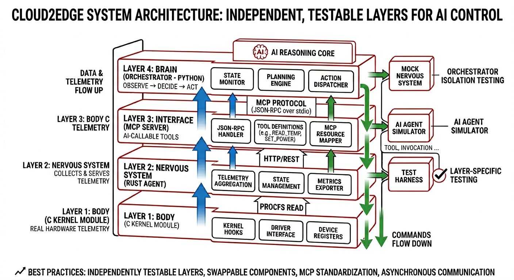

# Cloud2Edge

Agentic AI-powered cloud-to-edge infrastructure platform. A self-healing edge system that monitors hardware telemetry and takes autonomous corrective action through AI-callable tooling.

Built with C (kernel module), Rust (telemetry agent), Python (MCP server + orchestrator), Docker, and k3s.

---

## Architecture



```
Layer 4: BRAIN           — Orchestrator (Python) — observe → decide → act
              ↕ MCP protocol (JSON-RPC over stdio)
Layer 3: INTERFACE       — MCP Server (Python) — AI-callable tools
              ↕ HTTP/REST
Layer 2: NERVOUS SYSTEM  — Rust Agent — collects + serves telemetry
              ↕ procfs read
Layer 1: BODY            — Kernel Module (C) — real hardware telemetry
```

Data flows up. Commands flow down. Each layer is independently testable and swappable. The MCP layer makes the system callable by any AI agent.

---

## Components

| Component | Language | What it does |
|-----------|----------|--------------|
| [kernel-module](kernel-module/) | C | Exposes CPU temp, memory pressure, TCP retransmits via `/proc/edge_sensor` |
| [rust-agent](rust-agent/) | Rust | Reads procfs, serves JSON telemetry over HTTP (port 3000) |
| [mcp-server](mcp-server/) | Python | MCP tools: `get_telemetry`, `check_health`, `restart_service` |
| [orchestrator](orchestrator/) | Python | Agentic loop — monitors thresholds, calls MCP tools autonomously |
| [deploy](deploy/) | Docker/k3s | Container images + Kubernetes manifests for edge deployment |

---

## Quickstart

### Prerequisites

- Linux (kernel headers installed)
- Rust 1.95+
- Python 3.12+
- Docker (optional, for containers)

### Run locally

```bash
# 1. Build and load kernel module
cd kernel-module && make
sudo insmod src/edge_sensor.ko
cat /proc/edge_sensor

# 2. Start the Rust agent
cd ../rust-agent && cargo run &

# 3. Verify telemetry
curl http://localhost:3000/telemetry
curl http://localhost:3000/health

# 4. Run the orchestrator (with low threshold to see it trigger)
cd ../orchestrator
python3 -m venv .venv && source .venv/bin/activate
pip install -r requirements.txt
CPU_TEMP_THRESHOLD=40 POLL_INTERVAL=3 python agent.py

# 5. Cleanup
sudo rmmod edge_sensor
```

---

## Development

See [CONTRIBUTING.md](CONTRIBUTING.md) for:
- Git workflow (issue-driven GitHub Flow)
- Conventional commits
- Branching and PR process
- Versioning and releases
- CI/CD pipeline

---

## CI/CD

GitHub Actions pipeline with per-component jobs:

| Job | What it runs |
|-----|-------------|
| Validate structure | Required files and VERSION checks |
| Rust Agent | `cargo check` + `clippy` + `test` + `cargo-audit` |
| MCP Server | `py_compile` + `pytest` + `pip-audit` |
| Orchestrator | `py_compile` + `pytest` + `pip-audit` |
| Docker lint | `hadolint` on both Dockerfiles |

---

## Project Status

| Milestone | Status |
|-----------|--------|
| 1. Kernel Module | ✅ Complete |
| 2. Rust Agent | ✅ Complete |
| 3. MCP Server | ✅ Complete |
| 4. Containerization | ✅ Complete |
| 5. Orchestrator | ✅ Complete |
| 6. CI/CD & Polish | ✅ Complete |

---

## AI Client Integration

The MCP server makes Cloud2Edge callable by any AI agent. Here's how to connect:

### Claude Desktop

Add to `~/.config/claude/claude_desktop_config.json`:

```json
{
  "mcpServers": {
    "cloud2edge": {
      "command": "python",
      "args": ["/path/to/Cloud2Edge/mcp-server/src/server.py"],
      "env": {
        "AGENT_URL": "http://localhost:3000"
      }
    }
  }
}
```

Now you can say: *"Check my edge device health"* or *"What's the CPU temperature?"* and Claude will call the MCP tools directly.

### Amazon Q Developer

Register as an MCP server in your IDE's Amazon Q settings. The tools appear as callable actions in chat.

### Voice Assistants (Google Home / Alexa / Custom Assistant)

Expose the MCP server via SSE transport, then bridge to a voice assistant:

```python
# In server.py, change the transport:
if __name__ == "__main__":
    mcp.run(transport="sse", host="0.0.0.0", port=8080)
```

Then create a webhook/skill that:
1. Receives voice intent ("check my server health")
2. Calls the MCP server's SSE endpoint
3. Speaks the result back

This works with any voice platform that supports custom skills/actions (Alexa Skills, Google Actions, Home Assistant).

### Any MCP-Compatible Client

The server implements the standard [Model Context Protocol](https://modelcontextprotocol.io/). Any client that speaks MCP can discover and call the tools automatically — no custom integration needed.

---

## Roadmap

| Future Milestone | Description |
|-----------------|-------------|
| Multi-platform agent | macOS, Windows, Raspberry Pi support via conditional compilation |
| Physical sensors | GPIO/I2C integration (DHT22, PIR, rain, proximity) |
| AI client demo | Live Claude Desktop / voice assistant integration |
| Lab deployment | k3s cluster across home machines |
| Alerting | Slack, email, PagerDuty on threshold breach |
| Metrics history | Prometheus + Grafana dashboards |
| Rate-based alerting | TCP retransmit delta instead of cumulative |

---

## License

[MIT](LICENSE)
